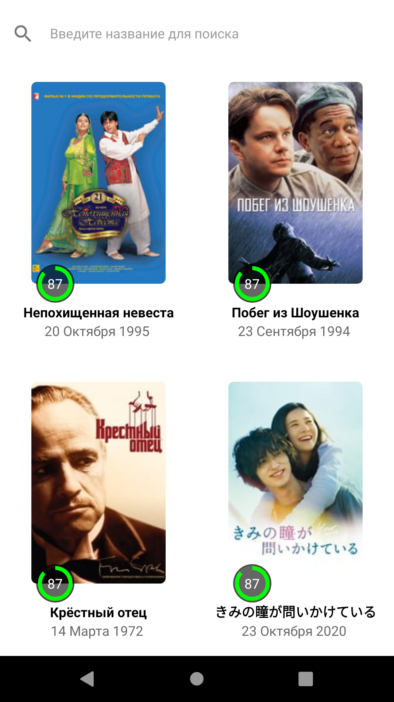
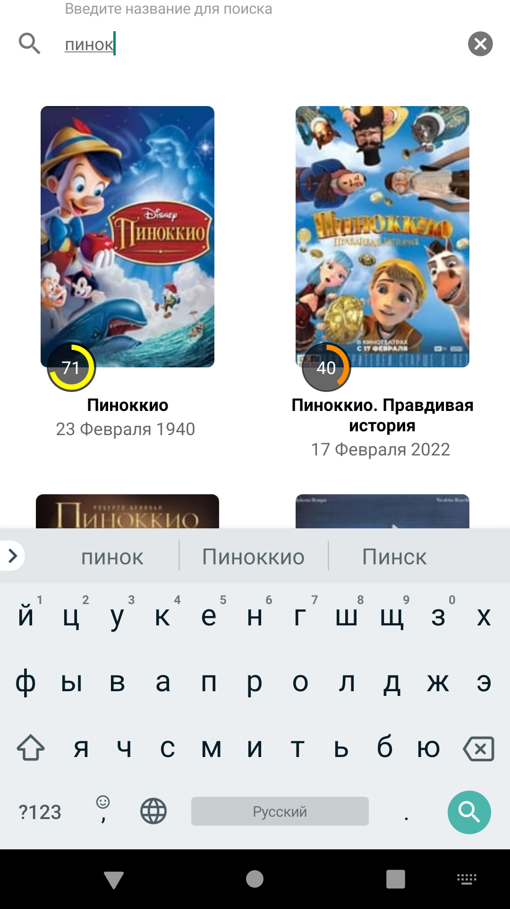
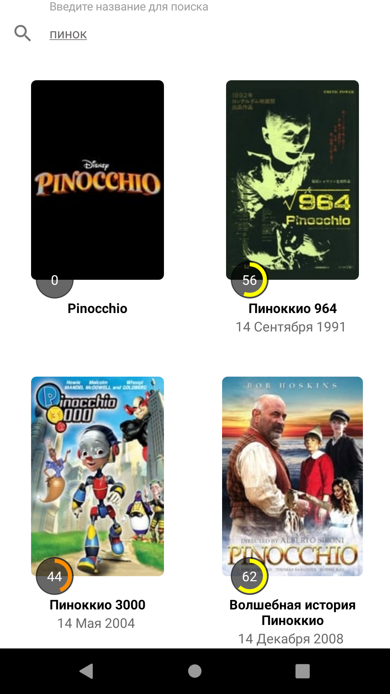
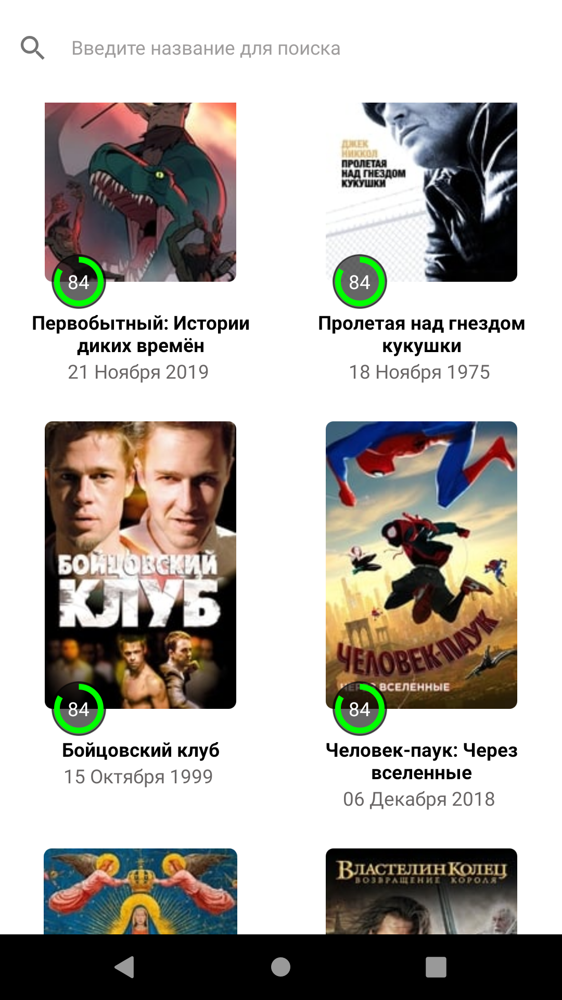
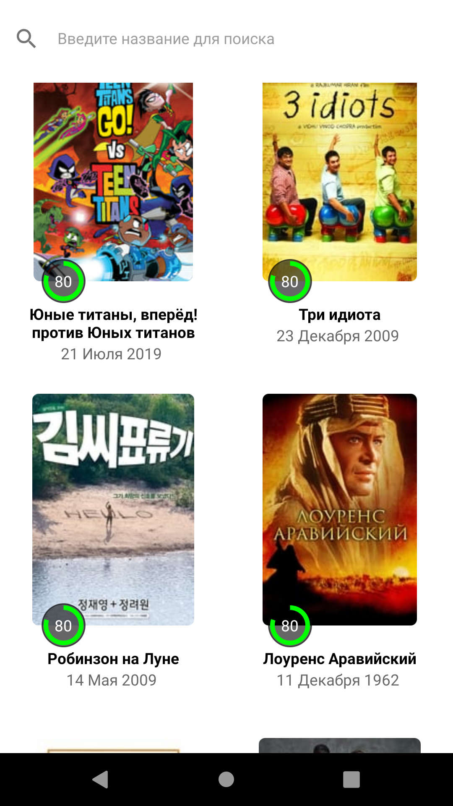

# Факультет: Android-разработки Курс: Подготовка к собеседованию Android-разработчика

### Домашние задания:
---
### Домашнее задание №2
- Отображает список фильмов и поддерживает пагинацию. API можно найти по ссылке https://developers.themoviedb.org/3/getting-started/introduction;
- При тапе на элемент списка должен отображаться экран с описанием выбранного фильма;
- Опционально:
 * иконка рейтинга фильма,
 * список актеров и их фото,
 * поиск по фильмам на главном экране,
 * тесты.

---

